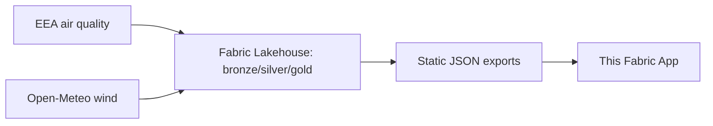

# WindFingerprint

> Joins hourly pollutant concentration to hourly wind direction and speed, and draws the two plots that
> show where a station's pollution is actually coming from.


**Live showcase:** https://ancovandenberg.github.io/FabricApps/windfingerprint/ (static GitHub Pages
build, no Fabric backend -- see [Showcase build](#showcase-build) below. The Fabric-hosted app itself
isn't kept running.)

## What it does

Air quality monitoring stations report *how much* pollution is in the air, but not *where it's coming
from*. Pollution travels with the wind, so if concentration near a station is consistently high whenever
the wind blows from one direction, that's a strong clue where it originates.

For any station/pollutant combination, WindFingerprint renders a bivariate polar plot (mean concentration
by wind sector and speed bin — a hot spot at the centre means a local source, a lobe further out means a
distant one in that direction), a conditional probability function (CPF) rose (share of hours exceeding a
threshold, by direction — the sharper of the two attribution tools), and the CPF rose overlaid on a real
OpenStreetMap basemap centred on the station, so you can see what's actually sitting in the direction it
points to. A threshold slider recomputes the CPF rose instantly from a precomputed histogram, client-side,
no request per move.

## Data

| | |
| --- | --- |
| **Source** | [EEA Air Quality Download Service](https://eeadmz1-downloads-webapp.azurewebsites.net/) (pollutant concentration) + [Open-Meteo](https://open-meteo.com/) historical ERA5 reanalysis (wind) |
| **Licence** | EEA: reuse permitted with attribution ("Source: European Environment Agency (EEA)"). Open-Meteo: CC BY 4.0, non-commercial tier. |
| **Refresh** | One-off. Ingested 2020–2025 via a Fabric Lakehouse pipeline (bronze/silver/gold notebooks, not in this repo), then exported to static JSON. Not live. |
| **Size** | 20 Dutch monitoring stations, 2.5M+ joined hourly readings in the Lakehouse; 57 precomputed JSON files (~17 KB each) shipped in `public/exports/`. |

```bash
# No fetch script: public/exports/*.json is the committed application data, already
# in this repo. Regenerating it needs the Fabric Lakehouse pipeline (bronze/silver/
# gold notebooks + a gold-layer export notebook), which lives in the Fabric
# workspace, not here.
```

## How it is built

- **Data model:** `rayfin/data/` — `SavedView` (station/pollutant/period/threshold) and `Annotation`
  (per-sector notes), both owner-scoped. The pollution data itself isn't in this database.
- **Backend:** Fabric SQL database + generated GraphQL API, for the two entities above only. The
  fingerprint data is precomputed static JSON, not queried live — see "What I learned."
- **Semantic model:** none. No Power BI/DAX in this app.
- **Frontend:** React 19 + Vite + TypeScript. Vega-Lite for the two polar charts, Leaflet + OpenStreetMap
  for the map overlay.



## Run it locally

```bash
npm install
cp rayfin/.env.example rayfin/.env
npm run dev
```

Local sign-in uses a fixed dev account (`dev@contoso.com`) against the bundled local backend — no real
Entra/Fabric sign-in needed. Nothing else to prepare: the 57 static exports are already committed, so the
charts show real data immediately.

## Deploy

```bash
npx rayfin up --workspace "<your-workspace>"
```

Set `services.functions.enabled: false` in `rayfin/rayfin.yml` first — Fabric doesn't yet support running
Rayfin Functions in production (see "What I learned").

## Showcase build

The Fabric-hosted app requires Fabric SSO and isn't kept running, so there's a second, backend-less
build for the public link above:

```bash
npm run deploy:pages
```

This builds with `vite build --mode pages` (env in `.env.pages`, no secrets) — swaps in a
`StaticAuthService` instead of the real Fabric auth so no backend call ever happens, and publishes
`dist/` to the `windfingerprint/` folder of the repo's `gh-pages` branch. Re-run it any time to refresh
the demo with a newer build; nothing rebuilds automatically.

## What I learned

- The first version queried a Fabric Lakehouse SQL analytics endpoint live, one query per threshold
  change, using `NTILE(100)` to approximate a 90th-percentile threshold from a Rayfin Function. It
  worked, right up until deployment, which returned a plain 400: Fabric doesn't support running Rayfin
  Functions in production yet. Precomputing everything into static per-station/pollutant JSON (a grid
  plus a shared-edges histogram per wind sector) turned out simpler and faster than the live version it
  replaced — moving the threshold slider is a client-side linear interpolation now, no request.
- The EEA's validity flag has values 1 through 3, and 2 and 3 both mean "valid, but below the detection
  limit" — filtering on exactly 1 silently drops legitimate readings.
- The boundary between the EEA's verified and unverified datasets isn't the fixed year the documentation
  implies; some countries submit the previous year's verified data early, so the ingestion pipeline tries
  the verified dataset first and falls back to unverified only if that comes back empty, per year, per
  country.

## Known limits

- Only 20 stations in the Netherlands are loaded (2020–2025). The pipeline generalises to the rest of the
  EEA's network, but nothing else is ingested yet.
- No live data refresh — the static exports are a point-in-time snapshot from the Lakehouse pipeline.
- The Rayfin Function in `rayfin/functions/` is parked, not deleted, in case Fabric ships production
  Functions support later.
